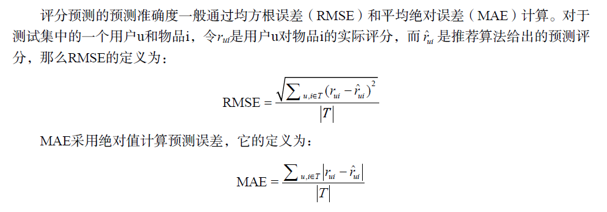
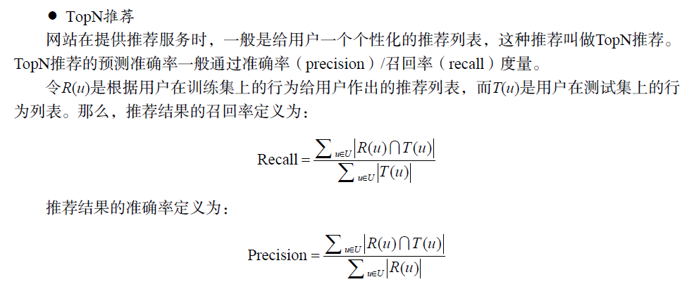
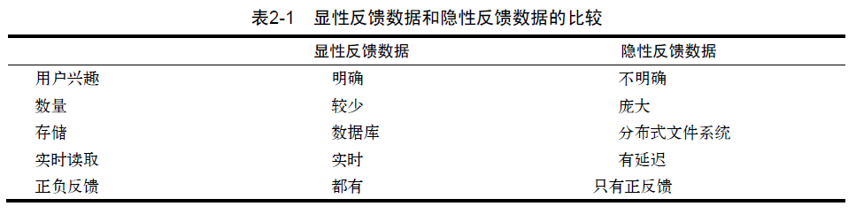
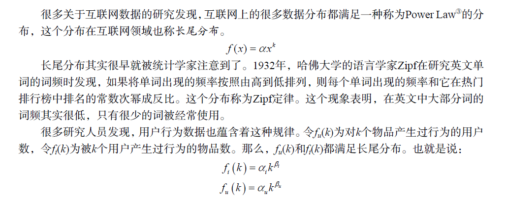
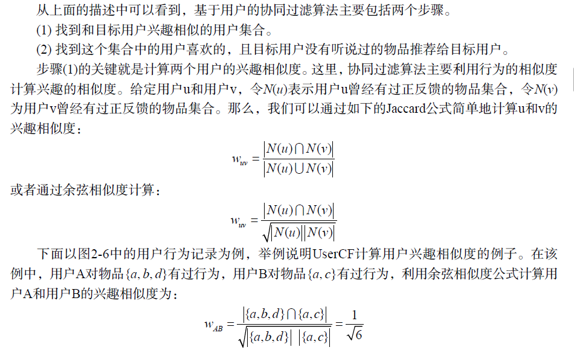
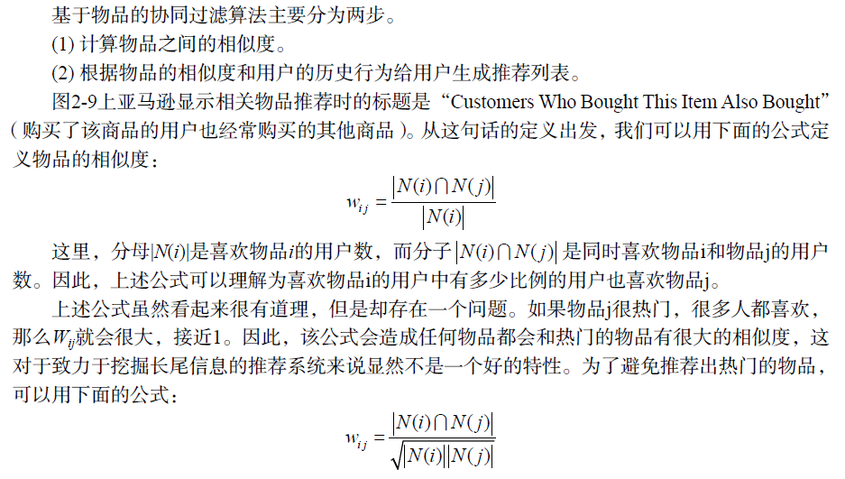

### 1.1推荐系统中3种评测推荐效果的实验方法
* 离线实验（offline experiment）
* 用户调查（user study）
* 在线实验（online experiment）
#### 1.1.1 离线实验
离线实验的方法一般由如下几个步骤构成：  
(1) 通过日志系统获得用户行为数据，并按照一定格式生成一个标准的数据集；  
(2) 将数据集按照一定的规则分成训练集和测试集；  
(3) 在训练集上训练用户兴趣模型，在测试集上进行预测；  
(4) 通过事先定义的离线指标评测算法在测试集上的预测结果。
***
这种实验方法的好处是不需要真实用户参与，可以直接快速地计算出来，从而方便、快速地测试大量不同的算法
***
#### 1.1.2 用户调查  
略
#### 1.1.3 在线实验
AB测试是一种很常用的在线评测算法的实验方法。它通过一定的规则将用户随机分成几组，
并对不同组的用户采用不同的算法，然后通过统计不同组用户的各种不同的评测指标比较不同算
法，比如可以统计不同组用户的点击率，通过点击率比较不同算法的性能。
评测指标
### 1.2 评测指标
#### 1.2.1 用户满意度
只能通过用户调查或者在线实验获得，在在线系统中，用户满意度主要通过一些对用户行为的统计得到。比如在电子商务网站中，
用户如果购买了推荐的商品，就表示他们在一定程度上满意。因此，我们可以利用购买率度量用
户的满意度。此外，有些网站会通过设计一些用户反馈界面收集用户满意度。比如在视频网站
Hulu的推荐页面（如图1-24所示）和豆瓣网络电台（如图1-25所示）中，都有对推荐结果满意或
者不满意的反馈按钮，通过统计两种按钮的单击情况就可以度量系统的用户满意度。更一般的情
况下，我们可以用点击率、用户停留时间和转化率等指标度量用户的满意度。
#### 1.2.2 预测准确度


假设我们用一个列表records存放用户评分数据，令records[i] = [u,i,rui,pui]，其
中rui是用户u对物品i的实际评分，pui是算法预测出来的用户u对物品i的评分，那么下面的代
码分别实现了RMSE和MAE的计算过程。
```python
def RMSE(records):
    return math.sqrt(\
    sum([(rui-pui)*(rui-pui) for u,i,rui,pui in records])/float(len(records)))
def MAE(records):
    return sum([abs(rui-pui) for u,i,rui,pui in records])/float(len(records))
```
关于RMSE和MAE这两个指标的优缺点， Netflix认为RMSE加大了对预测不准的用户物品评
分的惩罚（平方项的惩罚），因而对系统的评测更加苛刻。研究表明，如果评分系统是基于整数
建立的（即用户给的评分都是整数），那么对预测结果取整会降低MAE的误差。

```python
def PrecisionRecall(test, N):
    hit = 0
    n_recall = 0
    n_precision = 0
    for user, items in test.items():
        rank = Recommend(user, N)
        hit += len(rank & items)
        n_recall += len(items)
        n_precision += N
    return [hit / (1.0 * n_recall), hit / (1.0 * n_precision)]
```
#### 1.2.3 覆盖率
社会学领域有一个著名的马太效应，即所谓强者更强，弱者更弱的效应。如果一个系统会增
大热门物品和非热门物品的流行度差距，让热门的物品更加热门，不热门的物品更加不热门，那
么这个系统就有马太效应。比如，首页的热门排行榜就有马太效应。进入排行榜的都是热门的物
品，但它们因为被放在首页的排行榜展示有了更多的曝光机会，所以会更加热门。相反，没有进
入排行榜的物品得不到展示，就会更不热门。搜索引擎的PageRank算法也具有一定的马太效应，
如果一个网页的某个热门关键词排名很高，并因此被展示在搜索结果的第一条，那么它就会获得
更多的关注，从而获得更多的外链，PageRank排名也越高。
那么，推荐系统是否有马太效应呢？推荐系统的初衷是希望消除马太效应，使得各种物品都
能被展示给对它们感兴趣的某一类人群。但是，很多研究表明现在主流的推荐算法（比如协同过
滤算法）是具有马太效应的。评测推荐系统是否具有马太效应的简单办法就是使用基尼系数。如
果G1是从初始用户行为中计算出的物品流行度的基尼系数，G2是从推荐列表中计算出的物品流
行度的基尼系数，那么如果G2 > G1，就说明推荐算法具有马太效应。
#### 1.2.4 多样性
#### 1.2.5 新颖性
#### 1.2.6 惊喜度
#### 1.2.7 信任度
#### 1.2.8 实时性
#### 1.2.9 健壮性
#### 1.2.10 商业目标
### 2.1用户行为数据简介
用户行为在个性化推荐系统中一般分两种——显性反馈行为（explicit feedback）和隐性反馈
行为（implicit feedback）。  
* 显性反馈行为包括用户明确表示对物品喜好的行为，主要方式就是评分和喜欢/不喜欢。
* 隐性反馈行为指的是那些不能明确反应用户喜好的行为，最具代表性的隐性反馈行为就是页面浏览行为

按照反馈的明确性分，用户行为数据可以分为显性反馈和隐性反馈，但按照反馈的方向分，
又可以分为正反馈和负反馈。正反馈指用户的行为倾向于指用户喜欢该物品，而负反馈指用户的
行为倾向于指用户不喜欢该物品。在显性反馈中，很容易区分一个用户行为是正反馈还是负反馈，
而在隐性反馈行为中，就相对比较难以确定。
### 2.2 用户行为分析
#### 2.2.1 用户活跃度和物品流行度的分布

### 2.3 实验设计和算法评测

### 2.4 基于邻域的算法
#### 2.4.1 基于用户的协同过滤算法
##### 2.4.1.1 基础算法
  

_**余弦相似度计算**_
```python
def UserSimilarity(train):
    W = dict()
    for u in train.keys():
        for v in train.keys():
            if u == v:
                continue
            W[u][v] = len(train[u] & train[v])
            W[u][v] /= math.sqrt(len(train[u]) * len(train[v]) * 1.0)
    return W
```
可以运用倒排表进行代码优化，此处省略

##### 2.4.1.2 用户相似度计算的改进

#### 2.4.2 基于物品的协同过滤算法
